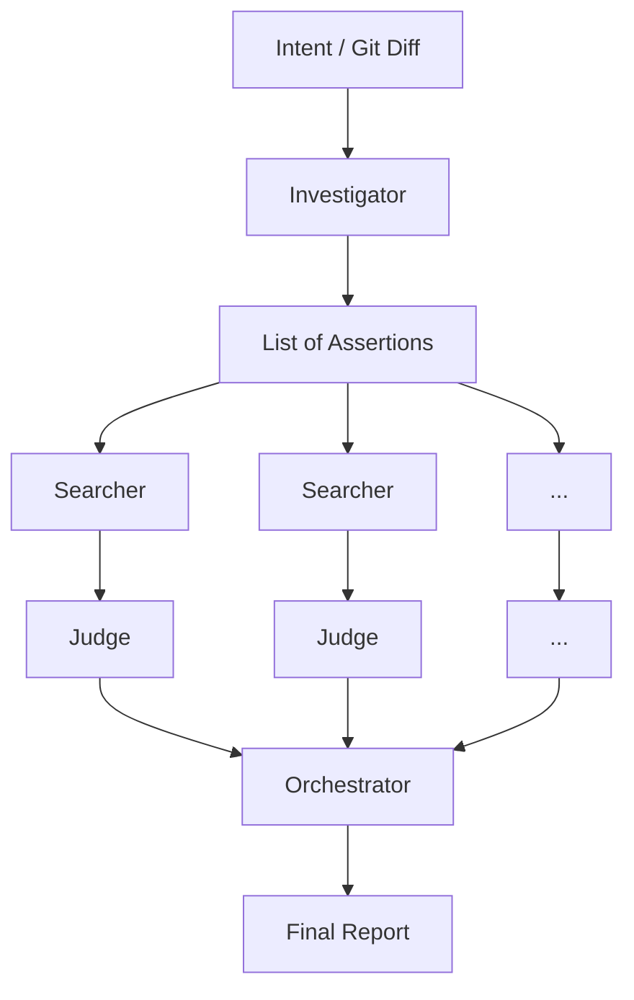

# Intent Completeness Checker

[](https://www.python.org/downloads/)
[](https://github.com/astral-sh/ruff)
[](https://github.com/pre-commit/pre-commit)

A multi-agent AI pipeline that verifies if an intended code modification was applied **completely** across an entire repository, preventing half-finished refactors and forgotten updates.

## 💡 Why this exists

AI coding assistants (like Cursor, Copilot, or Aider) are incredible at writing code, but they frequently suffer from "tunnel vision." When asked to perform a repository-wide change—like renaming an environment variable or migrating an API endpoint—they will perfectly update the main source files, but frequently forget to update documentation, Makefiles, CI scripts, or obscure tests.

The worst part? If you ask the agent "Did you update everything?", it will read its own recent changes, hallucinate completeness, and confidently answer "Yes." It assumes its own plan was perfectly executed.

To solve this, you need an **independent verification system**. The Intent Completeness Checker takes the original intent and the current state of the repo, breaks the intent down into precise assertions, and actively hunts for evidence of missed updates.

## ⚙️ How it works

The pipeline uses four distinct components (via the [Agno](https://github.com/agno-ai/agno) framework) to ensure objective verification:
- **Investigator**: Reads the original intent (or infers it from the current git diff) and breaks it down into a list of specific, testable assertions.
- **Searcher**: For each assertion, autonomously navigates the codebase using `ripgrep` to find any code, docs, or config that might violate it.
- **Judge**: Examines the Searcher's findings to determine if they are actual violations (missed updates) or just false positives.
- **Orchestrator**: Runs the Searchers and Judges concurrently for all assertions and aggregates the results into a final actionable report.



## 🚀 Installation

You will need a `GROQ_API_KEY` to run the default LLM (`llama-3.3-70b-versatile`). You can set it as an environment variable or via a `.env` file (copy `.env.example` to `.env`).

### 1. Via PyPI (Global Install)
*(Coming soon to PyPI)*
```bash
pip install intent-completeness-checker
```

### 2. Via `uv` (Recommended for Local Dev)
```bash
git clone https://github.com/userdeter1/Intent-Completeness-Checker.git
cd Intent-Completeness-Checker
uv sync
```

### 3. As a Pre-commit Hook (Best for Teams)
You can enforce completeness checks automatically before every commit. Add this to your `.pre-commit-config.yaml`:

```yaml
repos:
-   repo: https://github.com/userdeter1/Intent-Completeness-Checker
    rev: main  # Replace with a specific tag once published
    hooks:
    -   id: intentcheck
```

*Note: You must have `GROQ_API_KEY` exported in your terminal environment for the pre-commit hook to function.*

## 💻 Usage

The CLI (`intentcheck`) offers several modes, from simple investigation to full pipeline verification.

### Check current Git Diff automatically
If you run the pipeline without an intent, it will read your current uncommitted `git diff`, figure out what you were trying to do, and check if you missed anything!
```bash
intentcheck investigate --full-pipeline
```

### Check a specific Intent
```bash
intentcheck investigate --intent "Rename 'src' to 'lib' everywhere" --full-pipeline
```

### Output as JSON for CI/CD integrations
```bash
intentcheck investigate --full-pipeline --json > report.json
```

### Changing the AI Provider

By default, the application uses Groq. You can change the provider and model using `--provider` and `--model`, or via environment variables (`LLM_PROVIDER`, `LLM_MODEL_ID`).

*If you change the provider, you must install the corresponding SDK yourself (e.g., `pip install openai` for OpenAI).*

```bash
export OPENAI_API_KEY="sk-..."
intentcheck investigate --full-pipeline --provider openai --model gpt-4o
```

## 📊 Example Output

```text
╭──────────────────────── 🔍 Intent Completeness Report ─────────────────────────╮
│ Intent: Rename 'src' to 'lib'                                                  │
╰────────────────────────────────────────────────────────────────────────────────╯

✅ Assertions satisfied
┏━━━━┳━━━━━━━━━━━━━━━━━━━━━━━━━━━━━━━━━━━━━┳━━━━━━━━━━━━━━━━━━━━━━━━━━━━━━━━━━━┓
┃ ID ┃ Description                         ┃ Reasoning                         ┃
┡━━━━╇━━━━━━━━━━━━━━━━━━━━━━━━━━━━━━━━━━━━━╇━━━━━━━━━━━━━━━━━━━━━━━━━━━━━━━━━━━┩
│ A1 │ All instances of 'src/' in          │ Found 5 replacements in Makefiles │
│    │ Makefiles are updated to 'lib/'     │ and CI scripts.                   │
└────┴─────────────────────────────────────┴───────────────────────────────────┘

❌ Assertions violated
┏━━━━┳━━━━━━━━━━━━━━━━━━━━━━━━━━━━━━━━━━━━━┳━━━━━━━━━━┳━━━━━━━━━━━━━━━━━━┳━━━━━━━━━━━━━━━━━━━━━━━━━┓
┃ ID ┃ Description                         ┃ Verdict  ┃ Reasoning        ┃ Evidence                ┃
┡━━━━╇━━━━━━━━━━━━━━━━━━━━━━━━━━━━━━━━━━━━━╇━━━━━━━━━━╇━━━━━━━━━━━━━━━━━━╇━━━━━━━━━━━━━━━━━━━━━━━━━┩
│ A2 │ Documentation mentions of 'src'     │ VIOLATED │ Docs still point │ docs/setup.md:45        │
│    │ are updated to 'lib'                │          │ to 'src' folder. │ Please cd into src/     │
│    │                                     │          │                  │   ↳ Unchanged reference │
└────┴─────────────────────────────────────┴──────────┴──────────────────┴─────────────────────────┘

╭──────────────────────────────── Verdict global ────────────────────────────────╮
│ 1 satisfied  •  1 violated  •  0 uncertain  •  0 error(s)                      │
│ ❌ 1 problème(s) bloquant(s) détecté(s)                                        │
╰────────────────────────────────────────────────────────────────────────────────╯
```

## 🛡 Exit Codes

| Code | Meaning |
|------|---------|
| `0`  | Intent is completely applied (or there are uncertainties but no strict violations). |
| `1`  | At least one assertion was explicitly violated or a technical error occurred. |

This makes it easy to use `intentcheck` as a strict pre-commit hook or as a blocking step in your CI/CD pipeline.

## 🤝 Contributing

Contributions are welcome! Please ensure that:
1. `ruff check .` passes without errors.
2. `pytest` passes 100% of the test suite.

## 📜 License

MIT License
