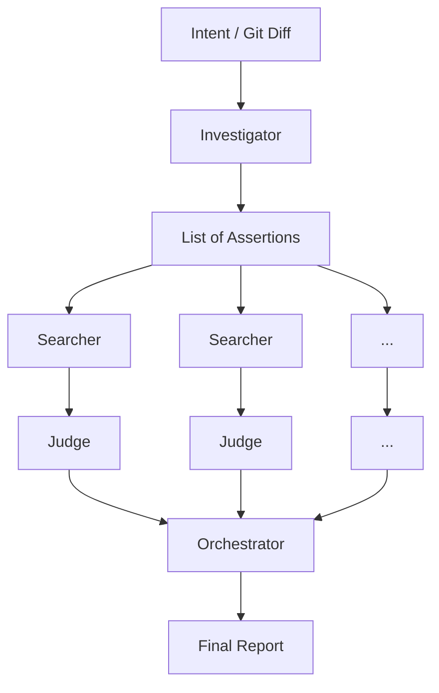

# Intent Completeness Checker

A multi-agent pipeline that verifies if an AI coding agent actually completed its intended changes across the entire repository, preventing half-finished refactors.

## Why

AI coding assistants (like Claude Code, Cursor, or Aider) are incredible at writing code, but they frequently suffer from "tunnel vision." When asked to perform a repository-wide change—like renaming an environment variable or migrating an API endpoint—they will perfectly update the main source files, but frequently forget to update documentation, Makefiles, CI scripts, or obscure tests.

The worst part? If you ask the same agent "Did you update everything?", it will read its own recent changes, hallucinate completeness, and confidently answer "Yes." It lies to you because it assumes its own plan was perfectly executed.

To solve this, you need an independent verification system. The Intent Completeness Checker takes the original intent and the current state of the repo, breaks the intent down into precise assertions, and actively hunts for evidence of missed updates.

## How it works

The pipeline uses four distinct components to ensure objective verification:
- **Investigator**: Reads the original intent (or infers it from the current git diff) and breaks it down into a list of specific, testable assertions.
- **Searcher**: For each assertion, autonomously navigates the codebase using ripgrep to find any code, docs, or config that might violate it.
- **Judge**: Examines the Searcher's findings to determine if they are actual violations (missed updates) or just false positives (dead code, unrelated terms).
- **Orchestrator**: Runs the Searchers and Judges concurrently for all assertions and aggregates the results into a final actionable report.

Crucially, this pipeline acts as an **independent** reviewer. Because it didn't write the code, it has no bias to assume the work is complete.



## Installation

You will need a `GROQ_API_KEY` to run the LLMs. You can set it as an environment variable or via a `.env` file (see `.env.example`).

### Via `uv` (Recommended)
```bash
uv sync
```

### Via `pip` standard
```bash
pip install -e ".[dev]"
```

## Usage

Here are some common ways to use the tool, from simple investigation to full pipeline verification.

1. **Just break down an intent into assertions (no search):**
```bash
intentcheck investigate --intent "Rename 'src' to 'lib'"
```

2. **Run the full pipeline with a specific intent:**
```bash
intentcheck investigate --intent "Rename 'src' to 'lib'" --full-pipeline
```

3. **Run the full pipeline based on the current git diff:**
```bash
intentcheck investigate --full-pipeline
```

4. **Output as JSON for CI integration:**
```bash
intentcheck investigate --full-pipeline --json > report.json
```

### Using a different LLM provider

By default, the application uses Groq (`llama-3.3-70b-versatile`). You can change the provider and model using the `--provider` and `--model` CLI arguments, or via environment variables (`LLM_PROVIDER`, `LLM_MODEL_ID`).

**Important**: If you change the provider, you must install the corresponding Python SDK yourself. The project does not include all provider SDKs by default to remain lightweight.

For example:
- **OpenAI**: `pip install openai` (requires `OPENAI_API_KEY`)
- **Anthropic**: `pip install anthropic` (requires `ANTHROPIC_API_KEY`)

Then you can run:
```bash
intentcheck investigate --intent "Refactor tests" --provider openai --model gpt-4o
```

### Example Terminal Output

```
╭──────────────────────── 🔍 Intent Completeness Report ─────────────────────────╮
│ Intent: Rename 'src' to 'lib'                                                  │
╰────────────────────────────────────────────────────────────────────────────────╯

✅ Assertions satisfied
┏━━━━┳━━━━━━━━━━━━━━━━━━━━━━━━━━━━━━━━━━━━━┳━━━━━━━━━━━━━━━━━━━━━━━━━━━━━━━━━━━┓
┃ ID ┃ Description                         ┃ Reasoning                         ┃
┡━━━━╇━━━━━━━━━━━━━━━━━━━━━━━━━━━━━━━━━━━━━╇━━━━━━━━━━━━━━━━━━━━━━━━━━━━━━━━━━━┩
│ A1 │ All instances of 'src/' in          │ Found 5 replacements in Makefiles │
│    │ Makefiles are updated to 'lib/'     │ and CI scripts.                   │
└────┴─────────────────────────────────────┴───────────────────────────────────┘

❌ Assertions violated
┏━━━━┳━━━━━━━━━━━━━━━━━━━━━━━━━━━━━━━━━━━━━┳━━━━━━━━━━┳━━━━━━━━━━━━━━━━━━┳━━━━━━━━━━━━━━━━━━━━━━━━━┓
┃ ID ┃ Description                         ┃ Verdict  ┃ Reasoning        ┃ Evidence                ┃
┡━━━━╇━━━━━━━━━━━━━━━━━━━━━━━━━━━━━━━━━━━━━╇━━━━━━━━━━╇━━━━━━━━━━━━━━━━━━╇━━━━━━━━━━━━━━━━━━━━━━━━━┩
│ A2 │ Documentation mentions of 'src'     │ VIOLATED │ Docs still point │ docs/setup.md:45        │
│    │ are updated to 'lib'                │          │ to 'src' folder. │ Please cd into src/     │
│    │                                     │          │                  │   ↳ Unchanged reference │
└────┴─────────────────────────────────────┴──────────┴──────────────────┴─────────────────────────┘

╭──────────────────────────────── Verdict global ────────────────────────────────╮
│ 1 satisfied  •  1 violated  •  0 uncertain  •  0 error(s)                      │
│ ❌ 1 problème(s) bloquant(s) détecté(s)                                        │
╰────────────────────────────────────────────────────────────────────────────────╯
```

## Exit Codes

| Code | Meaning |
|------|---------|
| `0`  | Intent is completely applied (or there are uncertainties but no strict violations). |
| `1`  | At least one assertion was explicitly violated or a technical error occurred. |

This makes it easy to use `intentcheck` as a strict pre-commit hook or as a blocking step in your CI/CD pipeline.

## Architecture

- **Investigator** (`agents/investigator.py`)
- **Searcher** (`agents/searcher.py`)
- **Judge** (`agents/judge.py`)
- **Orchestrator** (`core/orchestrator.py`)

**Tech Stack:** Python 3.11+, [Agno](https://github.com/agno-ai/agno) (agent framework), Groq/Llama models, Typer (CLI), Rich (terminal formatting), Pydantic v2 (structured outputs).

## Known Limitations

- **No Dedicated Semantic Detection:** It relies entirely on the LLM's reasoning combined with `ripgrep`. It does not build an AST or an embeddings database.
- **Large Repository Performance:** Not yet optimized for massive monorepos (10,000+ files). The search strategy is fast, but context windows might struggle if the ripgrep output is huge.
- **No GitHub Action Yet:** Must be run locally or invoked via custom shell scripts in CI.

## Contributing

Contributions are welcome! Please ensure that:
1. `ruff check .` passes without errors.
2. `pytest` passes (requires `pytest-asyncio`, which is already included in both the `uv` and `pip` installation paths).

## License

MIT License
