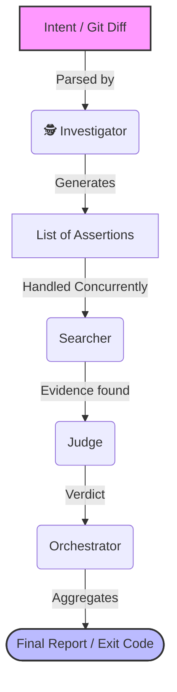

<div align="center">
  
  
  
  

  <h1>Intent Completeness Checker</h1>
  <p>
    <b>A Multi-Agent AI Pipeline for Code Verification (Powered by <a href="https://www.agno.com/">Agno Framework</a>)</b><br />
    Ensure your AI coding assistants finish what they started. No more half-finished refactors.
  </p>
</div>

<br />

##  Table of Contents
- [About The Project](#-about-the-project)
- [How It Works](#-how-it-works)
- [Getting Started](#-getting-started)
  - [Prerequisites](#prerequisites)
  - [Installation](#installation)
- [Usage](#-usage)
  - [CLI Commands](#cli-commands)
  - [CI/CD & Pre-commit Integration](#cicd--pre-commit-integration)
- [Configuration](#-configuration)
- [Contributing](#-contributing)
- [License](#-license)

---

##  About The Project

AI coding assistants (like Cursor, GitHub Copilot, or Aider) are incredible at writing code, but they frequently suffer from **"tunnel vision"**. 

When asked to perform a repository-wide change—like renaming an environment variable or migrating an API endpoint—they will perfectly update the main source files, but frequently **forget to update documentation, Makefiles, CI scripts, or obscure tests.**

The worst part? If you ask the agent *"Did you update everything?"*, it will read its own recent changes, hallucinate completeness, and confidently answer *"Yes."* It trusts its own plan too much.

**Intent Completeness Checker** acts as an **independent, objective reviewer**. It takes the original intent and the current state of the repository, breaks the intent down into precise assertions, and actively hunts for evidence of missed updates.

---

##  How It Works

This project leverages the [Agno](https://github.com/agno-ai/agno) framework to orchestrate four distinct AI agents:

1.  **Investigator**: Analyzes the original intent (or the current `git diff`) and breaks it down into a strict list of testable assertions.
2.  **Searcher**: Autonomously navigates the codebase using `ripgrep` to hunt for missed code, docs, or config files.
3.  **Judge**: Examines the Searcher's findings to filter out false positives and determine if a true violation occurred.
4.  **Orchestrator**: Manages concurrency, coordinates the agents, and generates a structured, actionable final report.



---

##  Getting Started

### Prerequisites
- **Python 3.11** or higher
- **Git** (The tool relies on Git to analyze repository changes)
- An API Key from an LLM provider (e.g., OpenAI, Anthropic, or Groq)

### Installation

**Option 1: For Local Development (Recommended)**
```bash
git clone https://github.com/userdeter1/Intent-Completeness-Checker.git
cd Intent-Completeness-Checker
uv sync
```

**Option 2: Global Installation via PyPI** *(Coming soon)*
```bash
pip install intent-completeness-checker
```

---

##  Usage

The Command Line Interface (`intentcheck`) is designed to be simple but extremely powerful.

### 1. The Magic Command: Check current Git Diff
If you run the tool without arguments, it will automatically read your uncommitted `git diff`, figure out what you were trying to do, and warn you if you forgot anything!
```bash
intentcheck investigate --full-pipeline
```

### 2. Check a Specific Intent
Explicitly tell the tool what the intended change was:
```bash
intentcheck investigate --intent "Rename 'src' folder to 'lib' everywhere" --full-pipeline
```

### 3. CI/CD Mode (JSON Output)
For headless environments, get a clean JSON output instead of the visual terminal UI:
```bash
intentcheck investigate --full-pipeline --json > report.json
```

### 4. Example Output

When the tool finishes analyzing your codebase, it prints a beautiful, easy-to-read report directly in your terminal:

```text
╭─────────────────────  Intent Completeness Report ──────────────────────╮
│ Intent: Rename OLD_API_KEY to NEW_API_KEY everywhere.                    │
╰──────────────────────────────────────────────────────────────────────────╯

                          ✅ Assertions satisfied
┏━━━━┳━━━━━━━━━━━━━━━━━━━━━━━━━━━━━━━━━━┳━━━━━━━━━━━━━━━━━━━━━━━━━━━━━━━━━━┓
┃ ID ┃ Description                      ┃ Reasoning                        ┃
┡━━━━╇━━━━━━━━━━━━━━━━━━━━━━━━━━━━━━━━━━╇━━━━━━━━━━━━━━━━━━━━━━━━━━━━━━━━━━┩
│ A1 │ OLD_API_KEY should no longer be  │ I searched for 'OLD_API_KEY' in  │
│    │ used in the codebase.            │ the entire project and found 0   │
│    │                                  │ occurrences. The rename was      │
│    │                                  │ successfully applied.            │
└────┴──────────────────────────────────┴──────────────────────────────────┘

                                 ❌ Assertions violated                     
┏━━━━┳━━━━━━━━━━━━━━━━━━━┳━━━━━━━━━━┳━━━━━━━━━━━━━━━━━━┳━━━━━━━━━━━━━━━━━━━━┓
┃ ID ┃ Description       ┃ Verdict  ┃ Reasoning        ┃ Evidence           ┃
┡━━━━╇━━━━━━━━━━━━━━━━━━━╇━━━━━━━━━━╇━━━━━━━━━━━━━━━━━━╇━━━━━━━━━━━━━━━━━━━━┩
│ A2 │ NEW_API_KEY must  │ VIOLATED │ The get_key()    │ auth.py:42         │
│    │ replace the old   │          │ function still   │   return OLD_API_KEY │
│    │ variable in the   │          │ returns the old  │                    │
│    │ auth init         │          │ variable. The    │   ↳ This line      │
│    │ function.         │          │ refactoring is   │ still uses the old │
│    │                   │          │ incomplete.      │ variable name.     │
└────┴───────────────────┴──────────┴──────────────────┴────────────────────┘

╭───────────────────────────── Global Verdict ─────────────────────────────╮
│ 1 satisfied  •  1 violated  •  0 uncertain                               │
│ •  0 error(s)                                                            │
│ ❌ 1 blocking issue(s) detected                                          │
╰──────────────────────────────────────────────────────────────────────────╯
```

---

## 🔗 CI/CD & Pre-commit Integration

Because the tool exits with Code `1` if a violation is found, it is perfect for blocking incomplete commits.

Add this to your repository's `.pre-commit-config.yaml`:
```yaml
repos:
-   repo: https://github.com/userdeter1/Intent-Completeness-Checker
    rev: main  # Replace with a specific release tag
    hooks:
    -   id: intentcheck
```
* Note: You must have `GROQ_API_KEY` exported in your terminal environment for the pre-commit hook to function.*

---

## 🛠 Configuration

The tool is provider-agnostic and **requires** you to specify which LLM provider and model you want to use.

### Environment Variables
Copy `.env.example` to `.env` and configure your API keys and provider:
```bash
LLM_PROVIDER=openai
LLM_MODEL_ID=gpt-4o
OPENAI_API_KEY="sk-..."
```

### Using Alternative LLM Providers
You can switch providers on the fly using CLI flags. Make sure you install the required SDK first.

**Using OpenAI (`gpt-4o`)**
```bash
pip install openai
export OPENAI_API_KEY="sk-..."
intentcheck investigate --full-pipeline --provider openai --model gpt-4o
```

**Using Anthropic (`claude-3-5-sonnet-latest`)**
```bash
pip install anthropic
export ANTHROPIC_API_KEY="sk-ant-..."
intentcheck investigate --full-pipeline --provider anthropic --model claude-3-5-sonnet-latest
```

---

##  Contributing

Contributions make the open-source community an amazing place to learn, inspire, and create. Any contributions you make are **greatly appreciated**.

1. Fork the Project
2. Create your Feature Branch (`git checkout -b feature/AmazingFeature`)
3. Ensure Code Quality (`ruff check .` and `pytest tests/ -v`)
4. Commit your Changes (`git commit -m 'Add some AmazingFeature'`)
5. Push to the Branch (`git push origin feature/AmazingFeature`)
6. Open a Pull Request

---

##  License

Distributed under the MIT License. See `LICENSE` for more information.
